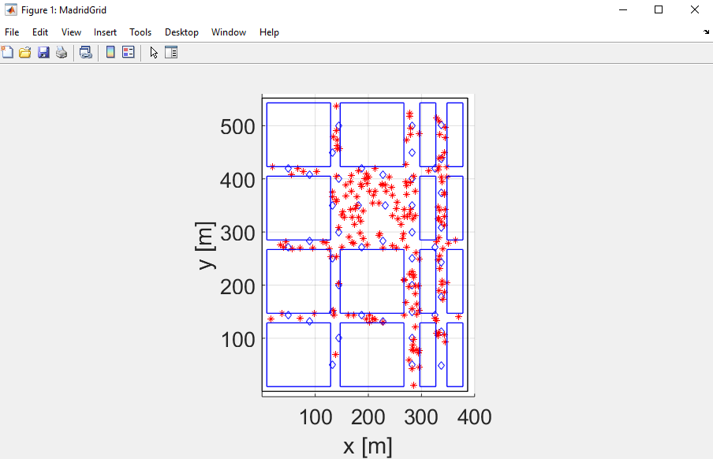
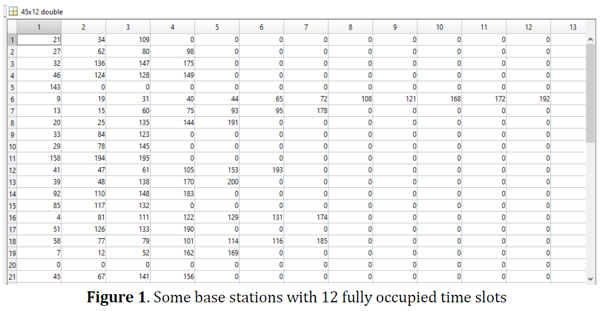
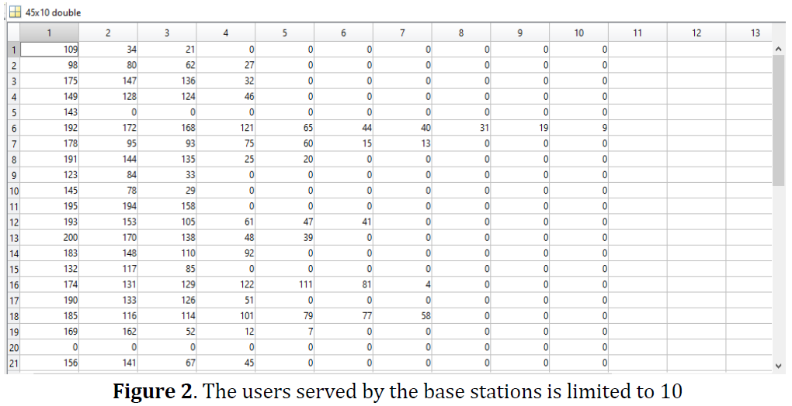
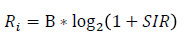
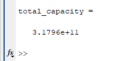
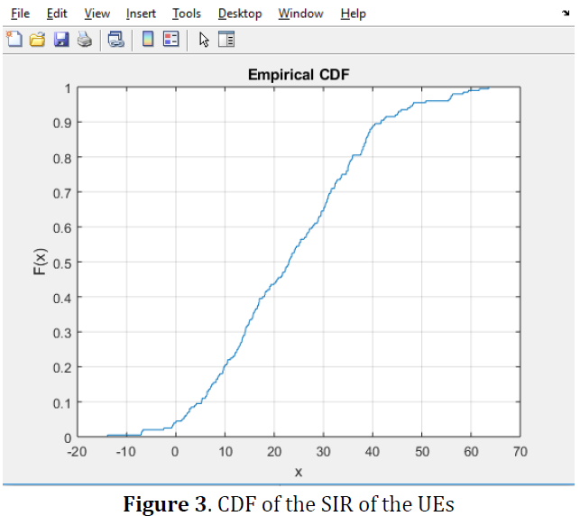
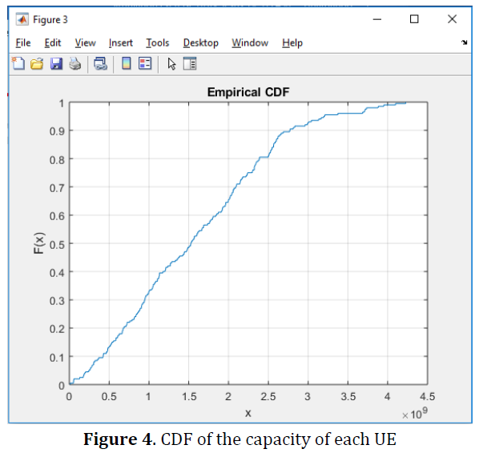

<!-- Radio Resource and Spectrum Management -->
## Scheduling in Ultra Dense Networks (UDN)

### Introduction
This simulation models a map-based scenario where the UEs are placed along with the base stations, considering that the dimensions of the grid was a rectangle of 400mx500m, in this area there were 45 base stations and the users were attached to each base station according to the best RSSI value. The model also takes into account specular multipath propagation components based on diffraction and reflections.:



It is interesting to observe how the GADIA (Greedy Asynchronous Distributed Interference Avoidance Algorithm) algorithm can be utilized in Ultra Dense Networks scenarios where the area is reduced and there are a high amount of base stations and UEs. The GADIA algotihm was implemented to perform the scheduling of the users in each base station, moreover, it was found that this algorithm is based on the lowest interference for each user in the base station, however, to improve the performance of the system and avoid overload of base stations I implemented a load balancing procedure where the users were distributed for every base station and no more than ten channels were allowed. This way, we observed the results and how this kind of load balancing affected the interference and the resulting throughput by plotting the CDF and observing the behavior of the graphic.

### Simulation
In the first part of the code there are defined the points where the base stations are located, in total there were 45 base stations distributed in a simulation grid of dimensions 400mx500m. In the simulated network there were placed 200 UEs randomly distributed on the grid, these UEs were assigned to each base station according to the RSSI level, which means that the UE is connected to the base station where it receives the best RSSI level. The problem with this approach is that for some base stations there were more than ten time slots allocated to serve the users. As observed in figure 1, there were some base stations that are overloaded with 12 time slots occupied and also there are some base stations with multiple time slots free. In this scenario of densification it is desirable to perform an efficient resource allocation and scheduling in order to avoid overloading the base stations and reduce as much as possible the interference .



The first task in the simulation was to limit the number of time slots in to 10 in each base station. In order to perform this load balancing, I have performed the following tasks:

1. Find the base stations serving more than 10 users.
2. Find the RSSI of all the users in each full BS.
3. Sort ascending the RSSI for each user.
4. Select the exact amount of users to be offloaded from the BS.
5. Select the second best RSSI BS for the selected users.
6. Validate if the destination BS has free time slots and the number of time slots is less than 10.
7. Assign the UE to the free time slot in the destination BS.
8. Repeat the process for every full BS.

After performing the previous steps, the resulting BS-UE association variable is sorted descending to remove as many time slots as needed according to the restriction that no more than 10 users must be served by each BS simultaneously, then we can observe that the number of users per base station is limited to 10:



After the load balancing process, the associated UEs in the grid are scheduled according to the Greedy Asynchronous Distributed Interference Avoidance Algorithm (GADIA). Then I have calculated the Signal to Interference Rate (SIR) for each UE by calculating the ratio between the RSSI of the corresponding UE against the total sum of the RSSI received from the other UEs connected to the same channel, it is important to notice that this calculation was performed in linear scale, after that the SIR vector was converted to dB in order to calculate the corresponding rate for each user by applying the formula:



In this case the bandwidth is a full 200 MHz channel. After obtaining the SIR vector and the rate vector I have calculated the total rate consumed in the system by summing all the rates of the 200 UEs, by observing the following variable:

```sh
total_capacity
```

The value obtained is the following:



In this case the total capacity of the simulated UDN is 317.96 Gbps.

Finally, the CDF for the SIR and the capacity of the UEs is plotted:






### Built With
* [Matlab2018](https://se.mathworks.com/products/matlab.html)