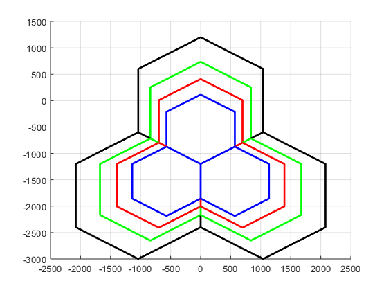

<!-- Radio Resource and Spectrum Management -->
## Frequency band selection
In this simulation a grid with three hexagonal sectors is created, where each cell contains four layers of mobile technologies corresponding each layer to a frequency band. The frequency bands considered for this simulation are the following: 2.6 GHz, 2.1 GHz, 1.8 GHz and 900 MHz, which are typical LTE bands. Since in wireless systems, the pathloss is a function of the frequency, it is expected that coverage of the cell is as well, i.e. the higher the frequency, the smaller the cell is:

```sh
Coverage@900MHz > Coverage@1.8GHz > Coverage@2.1GHz > Coverage@2.6GHz
```

The coverage of the cells in the simulation is a function of the 900MHz layer (the biggest coverage), then the coverage area of the layers is considered as follows:

* Layer1800 is 65% of the coverage area of the Laye900.
* Layer2100 is 45% of the coverage area of the Laye900.
* Layer2600 is 30% of the coverage area of the Laye900.

These parameters can be adjusted by modifying the following variables in the initial parameters of the script:

```sh
coverage_1800 = 0.65
coverage_2100 = 0.45
coverage_2600 = 0.30
```

Each cell is a multidimensional array containing cell's hexagons created with the function:

```sh
function [xdim,ydim] = create_hex(ymax,xcoord,ycoord)
```

Where:
* `**ymax**` : is the long leg of the hexagon.
* `**xcoord**` : is the coordinates of the center of the hexagon in the 'x axis'.
* `**ycoord**` : is the coordinates of the center of the hexagon in the 'y axis'.

The resulting grid is as follows:



### Simulation
After creating the grid I ran a Montecarlo simulation with the following conditions:

* Total number of snapshots is `200`.
* In each snapshot, `75` users are randomly distributed in each cell.

(These parameters can also be adjusted in the initial parameters of the script)

The simulation is intended to analyze two simple selection strategies:

**1st strategy**: if the user is within the coverage area of 2600 layer then it can select any of the 4 layers randomly, if the user is within the coverage area of 2100 layer then it can select any of the 3layers randomly, if the user is within the coverage area of 1800 layer then it can select any of the 2 layers randomly, and if the user is within the coverage area of 900 layer then it has to select the 900 layer. 

**2nd strategy**: if the user is within the coverage area of 2600 layer then it should select 2600 layer, if the user is within the coverage area of 2100 layer then it should select 2100 layer, if the user is within the coverage area of 1800 layer then it should select 1800 layer, and finally if the user is within the coverage area of 900 layer then it should select 900 layer.

After running the simulation I computed the percentage of users connected to the different layers in each selection strategies scheme:


### Built With
* [Matlab2018](https://se.mathworks.com/products/matlab.html)