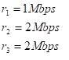
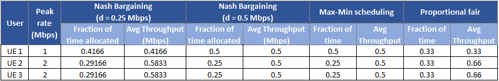
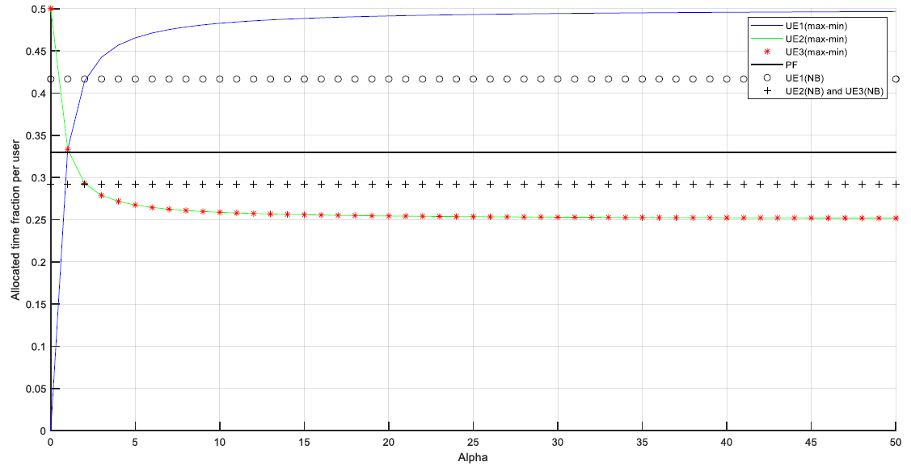
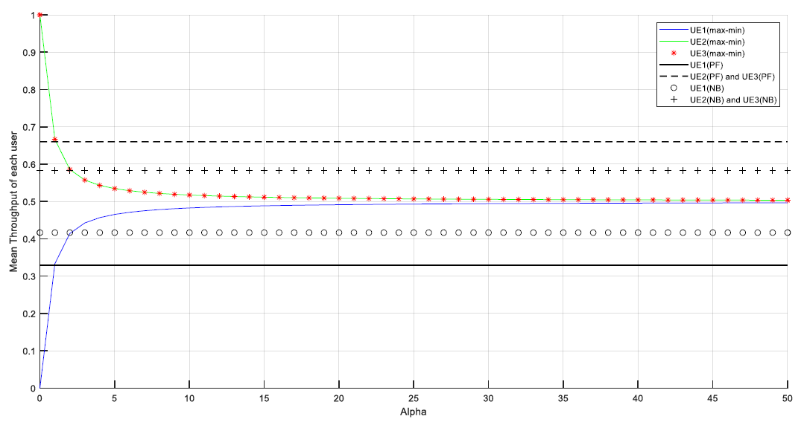
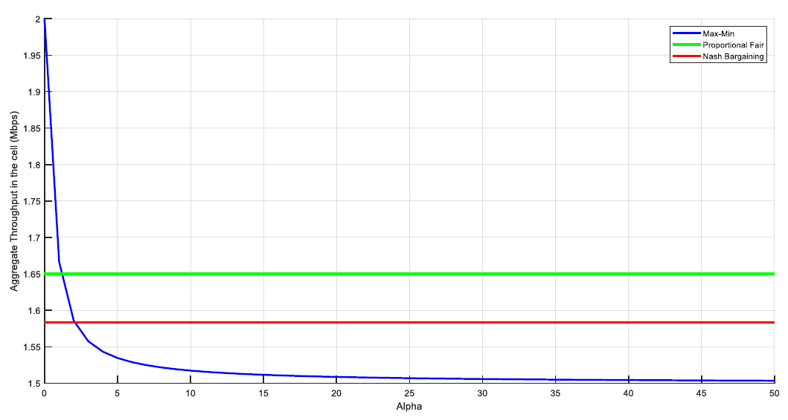

<!-- Radio Resource and Spectrum Management -->
## Scheduling and Fairness

### System
Considering a TDMA system where three users share the channel in time. The peak data
rate of user 1 is 1Mbps while users 2 and 3 achieve 2Mbps peak rate. the fairness of the system was tackled by implementing max-min fair
scheduling, proportional fair scheduling and Nash Bargaining scheduling. In this case we
have the following:

In the simulation the following parameters are determined:

* Fraction of time to be allocated for each user.
* Mean throughput of the users.
* Aggregate throughput in a cell.

When:

* Max-min fair scheduling is used.
* Proportional fair (PF) is used.
* Nash Bargaining (NB) is used, with:
  * The minimum tolerable rate is d = 250 kbps.
  * The minimum tolerable rate is d = 500 kbps.

Following a table summarizing the values of the throughput and fraction of time
to compare the results in each case:

In the table we can see that the system aims to balance the resources between
the users with a higher fairness value, like in the case of Max-min model where
the average throughput for every user is the same, unlike the case of the proportional fair model where the UE2
and UE3 are favored in terms of average throughput. In the case of the Nash
Bargaining model, when the minimum tolerable rate was increased this model
obtained fairness results similar to the Max-min scheduling in terms of average
throughput.

### Plots

Plot of the fraction of time allocated per user:

Plot with the values for mean throughput:

Plot with the values for aggregate throughput:

### How NOMA technology improves the fairness of the considered system
In NOMA (Nonorthogonal Multiple Access) networks it is also considered the utility function, which is a generalized form of the max-min and proportional fair approaches, to achieve the PA (Power Allocation) and fair network resource allocation for the users, but also the weighted sum rate that will provide a certain grade of fairness in the Media-access control (MAC) layer and the Jain’s fairness index comparison that will strike a tradeoff between the sum rate and the fairness of the system, are models implemented in NOMA that could improve the fairness of the system in the problem 1. In addition, there are more sophisticated and intelligent approaches proposed in NOMA to implement a fair PA among the users in the system, which are the Cognitive-Radio-Inspired Power Control, the User Scheduling in Dynamic Cluster/Pair-Based Hybrid MA Networks and the Software-Defined NOMA Network Architecture. 

### Calculations
The detailed calculations and results can be found **[here](scheduling-and-fairness.pdf)** and the corresponding Matlab script can be found **[here](script/scheduling-and-fairness.m)**. 

### Built With
* [Matlab2018](https://se.mathworks.com/products/matlab.html)